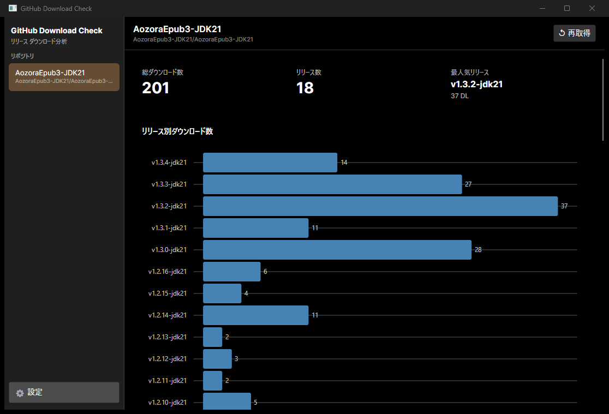

# GitHub Download Check

**GitHub リリースのダウンロード数を可視化するデスクトップアプリ**  
*A desktop app to visualize GitHub release download counts*



---

## 日本語

### 概要

GitHub リポジトリのリリースダウンロード数を取得・グラフ表示・分析する Windows デスクトップアプリです。  
複数リポジトリを登録して手軽に比較できます。

### 主な機能

- **サマリーカード** — 総DL数・リリース数・最人気リリースを一覧表示
- **リリース別ダウンロード数チャート** — 横棒グラフで各リリースのDL数を視覚化
- **アセット別ダウンロード数チャート** — ファイル単位での内訳（上位10件）
- **期間別ダウンロード数チャート** — スナップショット差分から日別・週別・月別を集計
- **トレンドチャート** — 累計DL数の時系列推移
- **スナップショット履歴** — 過去の取得データをテーブル表示
- **ダーク/ライトテーマ対応**
- **多言語対応** — 日本語・英語（OS ロケール自動判定）

### インストール

[Releases](https://github.com/Harusame64/github-download-check/releases) から最新版をダウンロードしてください。

| ファイル | 説明 |
|---|---|
| `GitHubDownloadCheck-x.x.x-win-x64.zip` | ZIP 展開して `GitHubDownloadCheck.exe` を実行 |
| `GitHubDownloadCheck-x.x.x.msi` | MSI インストーラー |

> [!IMPORTANT]
> **Windows SmartScreen の警告について**  
> 本アプリは個人開発のオープンソースソフトウェアであり、デジタル署名を行っていないため、実行時に「Windows によって PC が保護されました」という警告が表示される場合があります。  
> **回避方法:** 「詳細情報」をクリックし、表示された「実行」ボタンを押すことでインストール・起動が可能です。

### 使い方

1. アプリを起動
2. **設定（⚙）** → リポジトリを追加（`owner/repo` 形式）
3. サイドバーからリポジトリを選択 → データを自動取得
4. 「↺ 再取得」ボタンで最新データに更新

> **ヒント:** GitHub PAT（Personal Access Token）を設定すると API 制限が 60回/時 → 5,000回/時 に緩和されます。

### ビルド方法

#### 前提

- .NET 10 SDK
- PowerShell 7+
- [WiX Toolset v4](https://wixtoolset.org/) （MSI ビルド時のみ）

#### ビルド手順

```powershell
# ZIP + MSI を生成
.\build-dist.ps1 -Version "1.1.0"

# 出力先: dist/
```

### ローカライズ（翻訳）

翻訳スクリプトで英語リソースを自動生成できます。

```powershell
# 事前に環境変数をセット
$env:ANTHROPIC_API_KEY = "sk-ant-..."

# 英語リソースを生成
.\tools\translate-resx.ps1 -TargetLang en
```

---

## English

### Overview

A Windows desktop app that fetches, charts, and analyzes download counts for GitHub releases.  
Register multiple repositories and compare them at a glance.

### Features

- **Summary cards** — total downloads, release count, most popular release
- **Downloads by release chart** — horizontal bar chart per release
- **Downloads by asset chart** — per-file breakdown (top 10)
- **Period download chart** — daily / weekly / monthly aggregation from snapshot diffs
- **Trend chart** — cumulative download count over time
- **Snapshot history table** — past fetched data
- **Dark / Light theme support**
- **i18n** — Japanese and English (auto-detected from OS locale)

### Installation

Download the latest version from [Releases](https://github.com/Harusame64/github-download-check/releases).

| File | Description |
|---|---|
| `GitHubDownloadCheck-x.x.x-win-x64.zip` | Extract ZIP and run `GitHubDownloadCheck.exe` |
| `GitHubDownloadCheck-x.x.x.msi` | MSI installer |

> [!IMPORTANT]
> **About Windows SmartScreen Warning**  
> This is unsigned open-source software. Windows may show a "Windows protected your PC" warning during installation or first run.  
> **To proceed:** Click "More info" and then the "Run anyway" button.

### Usage

1. Launch the app
2. **Settings (⚙)** → add a repository (`owner/repo`)
3. Select a repository from the sidebar → data fetches automatically
4. Click **↺ Refresh** to pull the latest data

> **Tip:** Setting a GitHub PAT (Personal Access Token) raises the API limit from 60 req/hour to 5,000 req/hour.

### Building from Source

#### Prerequisites

- .NET 10 SDK
- PowerShell 7+
- [WiX Toolset v4](https://wixtoolset.org/) (MSI build only)

#### Build

```powershell
# Produce ZIP + MSI
.\build-dist.ps1 -Version "1.1.0"

# Output: dist/
```

### Localization

Use the translation script to auto-generate language resources via Claude API.

```powershell
# Set your API key first
$env:ANTHROPIC_API_KEY = "sk-ant-..."

# Generate English resource file
.\tools\translate-resx.ps1 -TargetLang en
```

---

## License

[MIT](LICENSE)
